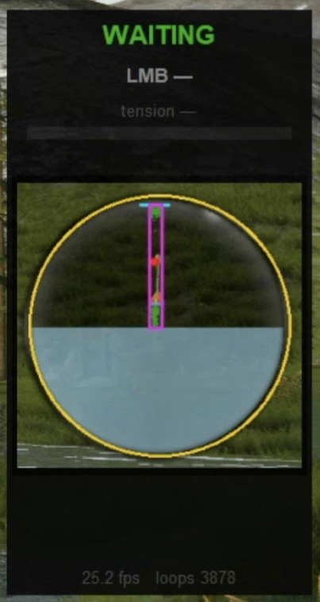
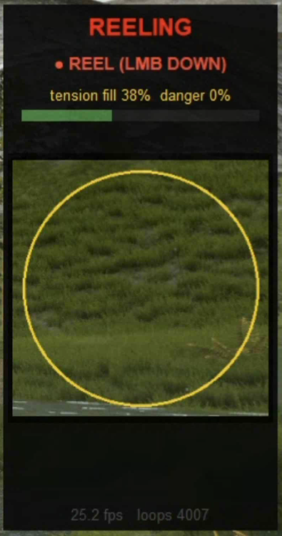

# UFS Auto-Fishing Bot

Auto-fishing bot for **Ultimate Fishing** (Steam, Unity 2017 + Mono backend).

The bot reads the game's `FishingFloat` / `FishingLine` / `FishingPlayer`
state directly out of the running game via a **BepInEx 5 plugin**, so
detection is precise instead of inferred from screen pixels. The plugin
also draws an in-game status overlay and exposes a command channel for
clicking sell/release/take buttons through Unity's UI event system —
no resolution-dependent screen clicks.

```
Game (UltimateFishing.exe)                              Bot (Python)
┌────────────────────────────────┐                    ┌──────────────┐
│  BepInEx                        │  UDP 18500 ──▶  │              │
│   └─ UfsFloatBridge.dll         │  state JSON      │  bot_memory  │
│       ├─ reads FishingFloat     │  60 Hz           │  ├─ FSM      │
│       ├─ reads FishingLine      │                  │  ├─ Mouse    │
│       ├─ reads FishingPlayer    │                  │  └─ Hotkeys  │
│       ├─ in-game OnGUI overlay  │ ◀── UDP 18501 ─  │              │
│       └─ Button.onClick.Invoke  │  cmds (sell etc) │              │
└────────────────────────────────┘                    └──────────────┘
```

## What's automated

- **Cast** → wait for bite → **strike at the right moment** (using
  `FishingFloat.fishTriesTimer` + `fish_tries_pull_timer`)
- **Reel-in with tension control** — eases off the reel when
  `FishingLine.currentTension >= 0.80` so the line never snaps
- **Catch dialog** — invokes `HUDWatchFish.watchSellBtn.onClick` via
  the plugin (resolution / focus independent)
- **Camera pose recall** — backquote (`` ` ``) saves the player's
  view; after each sell the plugin clamps the UFPS camera back to that
  pose for 6 s, undoing the watch-fish animation that otherwise leaves
  the rod pointing somewhere random
- **In-game status overlay** rendered through the plugin so it shows up
  in screenshots, screen recordings, and **Steam Remote Play** clients

## Setup (one-time)

### 1. Install BepInEx 5
Download `BepInEx_win_x64_5.4.x.zip` from
<https://github.com/BepInEx/BepInEx/releases>. Extract into the game
folder so you have:

```
C:\Program Files (x86)\Steam\steamapps\common\Ultimate Fishing\
├── UltimateFishing.exe
├── winhttp.dll          ← BepInEx loader
├── doorstop_config.ini
└── BepInEx\
    └── plugins\         ← plugin DLL goes here
```

Run the game once so BepInEx initialises (creates `BepInEx\config\`
and `LogOutput.log`).

### 2. Build & deploy the plugin

Requires .NET SDK 8 (`winget install Microsoft.DotNet.SDK.8`).

```powershell
cd plugin
dotnet build -c Release
```

The build target auto-copies `UfsFloatBridge.dll` into the game's
`BepInEx\plugins\` folder. Restart the game; `LogOutput.log` should
show:

```
[Info :UFS Float Bridge] UFS Float Bridge active. state -> 127.0.0.1:18500 ; cmds <- 127.0.0.1:18501
```

### 3. Set up the Python side

```powershell
py -m venv .venv
.venv\Scripts\python -m pip install -r requirements.txt
```

## Running the bot

```powershell
.venv\Scripts\python bot_memory.py
```

The bot starts **paused** (passive observation only). Tail of the
output looks like:

```
listening UDP 127.0.0.1:18500 (BepInEx plugin) ...
AUTO is OFF. Press Delete in the game to toggle. Ctrl+C to quit.
```

In-game, the overlay panel sits at the left-center of the screen.

### Hotkeys (in-game)

| Key | Effect |
|---|---|
| `Delete` | Toggle AUTO on / off (LMB safe-released when turning off) |
| `` ` `` (backquote) | Save current view direction (yaw + pitch) |
| `Ctrl+C` (terminal) | Quit the bot |

The bot **never quits on a hotkey** — Delete only pauses. Close it
from the terminal.

### CLI flags

| Flag | Meaning |
|---|---|
| `--dry` | Don't actually press the mouse — log only |
| `--no-cast` | Don't auto-cast; only fight + sell (player casts manually) |
| `--release-all` | Release every fish for XP grind instead of selling |
| `--no-overlay` | Hide the in-game overlay |
| `--tk-monitor` | Show the legacy Tkinter floating panel (host-only; not visible via Remote Play) |
| `--fps N` | Loop rate (default 60 Hz, matches plugin) |

## State machine

```
IDLE ─autostart─▶ AUTOCAST ─cast hold done─▶ CASTING ─isOnWater─▶ WAITING
                                                                     │
                                                          is_try_animation
                                                                     ▼
            ┌────────────────────────────────────────── BITE ◀───┐
            │  pull pulse + timer ≥ 0.8s              quiet 1.5s │
            ▼                                                    │
           HOOK ─has_fish or tension > 0─▶ FIGHT ─watch_fish─▶ LANDED
            │ no engagement in 3s                                 │
            ▼                                                     ▼
         WAITING                                          CATCH_DIALOG
                                                                  │ "sell" cmd
                                                                  ▼
                                                              AUTOCAST
```

Tunables live at the top of `state_machine_memory.py`:
`BITE_HOLD_S`, `BITE_TIMER_HOOK_MIN`, `HOOK_CONFIRM_S`,
`FIGHT_DONE_S`, `TENSION_EASE`, etc.

## Plugin commands (UDP 18501)

The Python side fires these by calling
`reader.send_command("…")` from `float_memory.FloatMemoryReader`.

| Command | Effect (plugin-side) |
|---|---|
| `sell` | `HUDManager.Instance.hudWatchFish.watchSellBtn.onClick.Invoke()` + arms camera restore |
| `release` | …`watchReleaseBtn`… |
| `take` | …`watchTakeBtn`… |
| `hud:show` / `hud:hide` | toggle the in-game overlay |
| `S\|<state>\|<action>\|<auto>\|<fps>` | bot pushes its own status for the overlay |

## Files

```
plugin/
├── UfsFloatBridge.csproj    .NET 4.6 plugin project
└── UfsFloatBridge.cs        BepInEx plugin (state emit + commands + overlay)

bot_memory.py                main bot loop + hotkeys + status push
state_machine_memory.py      memory-driven FSM (9 states)
float_memory.py              UDP listener + FloatState dataclass + send_command
status_monitor.py            optional Tk floating panel (--tk-monitor)
mouse_input.py               cross-platform LMB driver (used for cast/reel)
quartz_mouse.py              macOS mouse backend
win32_mouse.py               Windows mouse backend
config.py                    cast hold time, autostart delays, etc.
calibrate_window.py          one-shot helper to find the game window rect

classes/                     dnSpy-extracted game source for reference
  ├── FishingHands.cs
  ├── FishingFloat.cs
  ├── FishingLine.cs
  ├── HUDManager.cs
  └── HUDWatchFish.cs

legacy/                      old CV-based pipeline (kept for reference only)
  ├── bot.py                 old entry point (vision FSM + LMB driver)
  ├── state_machine.py       old FSM driven by preview-circle CV signals
  ├── play_segmentation.py   video-file player with CV overlay
  ├── segment_float.py       HSV segmentation of the bobber
  ├── catch_dialog.py        sell-button ROI color check
  ├── tension.py             tension-bar ROI color check
  ├── screen_capture.py      mss-based screen grabber
  ├── data/                  recorded float-tip traces (CSV)
  └── …                      various probe / diagnostic scripts
```

## Troubleshooting

- **Bot prints "listening UDP 127.0.0.1:18500" but never sees a packet**
  → Plugin not loaded. Check `BepInEx\LogOutput.log` for `UFS Float
  Bridge active.` Restart the game after each plugin rebuild.
- **`Method not found` errors in LogOutput.log** → Mono 2.0 BCL doesn't
  have a .NET 4 API the compiler emitted. Replace `lock`, `obj == null`
  on reflection types, etc. with manual `Monitor.Enter/Exit` and
  `ReferenceEquals(x, null)`.
- **Overlay doesn't show in Steam Remote Play** → The plugin draws via
  `OnGUI` so it's part of the game frame; it should always show. The
  Tkinter panel (`--tk-monitor`) is host-only.
- **Backquote hotkey doesn't fire in fishing mode** → The plugin uses
  Win32 `GetAsyncKeyState(VK_OEM_3)` to bypass UFS's input lock.
  Make sure the game window has focus.
- **Camera doesn't restore after sell** → Decompile `vp_FPCamera`
  in dnSpy and confirm the field names match `m_Pitch` / `m_Yaw`. The
  plugin tries `SetRotation(Vector2)` as a fallback.

---

# ufs-auto-bot


Auto-fishing bot for **Ultimate Fishing Simulator 1** (Windows). Watches the screen, segments the bobber preview circle, detects bites and tension, and drives the mouse to cast → wait → reel → sell → cast again.

The bot must run on the same Windows machine the game is running on. Synthetic mouse input does not pass through remote-desktop / streaming clients (Steam Remote Play, Moonlight, etc.).

## How it works

```
capture (mss) ──► segment float ──► tension monitor ──► catch-dialog detect
                                          │
                                          ▼
                               FSM (state_machine.py)
                                          │
                                          ▼
              IDLE → AUTOCAST → CASTING → WAITING → SUNK → REELING
                ▲                                                │
                └────────────── CATCH_DIALOG ◄───────────────────┘
                                          │
                            mouse driver (SendInput / Quartz)
```

- **Float segmentation** — HSV thresholding inside the right-side bobber preview circle. Tracks the antenna tip's `y` coordinate.
- **Bite detection** — float disappears for >80 ms while the preview UI is visible → SUNK → reel.
- **Tension monitor** — bottom bar's hue. Yellow/green = safe (hold LMB), red/orange = release LMB so the line doesn't snap.
- **Catch dialog** — green sell button at a fixed location. Bot clicks it then waits before next cast.
- **Auto-cast** — bot holds LMB for `CAST_HOLD_S` to charge, releases.

## Setup

```bat
py -m venv .venv
.venv\Scripts\python -m pip install -r requirements.txt

:: Calibrate the game-window rect (hover top-left then bottom-right corners)
.venv\Scripts\python calibrate_window.py
:: paste the printed GAME_WINDOW_RECT into config.py

:: Run
.venv\Scripts\python bot.py
```

## Tunables (config.py)

| Setting | Default | Purpose |
|--|--|--|
| `GAME_WINDOW_RECT` | `(0, 0, 2560, 1440)` | Screen rect of the game's rendered area |
| `PREVIEW_CIRCLE` | `(2396, 734, 126)` | Game-local `(cx, cy, r)` of the bobber preview |
| `TENSION_BAR_ROI` | `(720, 1393, 1840, 1408)` | Game-local tension bar rect |
| `SELL_BUTTON_CENTER` | `(1100, 1303)` | Game-local sell button click target |
| `CAST_HOLD_S` | `1.5` | LMB hold duration for cast charge |
| `POST_CATCH_DELAY_S` | `8.0` | Wait after catch dialog closes before re-casting |
| `AUTOSTART_FIRST_CAST` | `True` | Bot does the first cast itself after `AUTOSTART_DELAY_S` of IDLE |

All UI coordinates are **game-local** — they're translated to screen-absolute via `GAME_WINDOW_RECT`. Calibrated for `2560x1440`; scale proportionally for other resolutions.

## Controls

- `Delete` (anywhere on screen) — stop the bot, release the mouse
- `Ctrl+C` (terminal) — same

## CLI flags

```
bot.py [--dry] [--window] [--no-monitor] [--game-rect x,y,w,h]
       [--probe] [--probe-input] [--fps N] [--countdown N]
```

- `--dry` — no mouse input, log only
- `--window` — show OpenCV overlay (debug; steals focus)
- `--no-monitor` — disable the floating status panel
- `--probe-input` — one-shot test that synthetic input reaches the OS
- `--game-rect x,y,w,h` — override `GAME_WINDOW_RECT` from CLI

## Status panel

A small always-on-top window appears at the **left-center** of the primary display showing the FSM state, action (REEL / EASE), tension bar, catch-dialog flag, fps, and a live thumbnail of the segmented preview circle. Drag it anywhere with the mouse.

| WAITING | REELING |
|--|--|
|  |  |

## Files

| Module | Role |
|--|--|
| `bot.py` | Main capture → analyze → act loop |
| `config.py` | All tunable constants |
| `state_machine.py` | Fishing FSM |
| `screen_capture.py` | mss wrapper |
| `segment_float.py` | Float segmentation in preview circle |
| `tension.py` | Tension bar monitor |
| `catch_dialog.py` | Post-catch dialog detection |
| `mouse_input.py` | MouseDriver (Win32 SendInput backend) |
| `win32_mouse.py` | Windows mouse backend |
| `status_monitor.py` | Floating Tk status panel |
| `calibrate_window.py` | Game-window rect helper |
| `play_segmentation.py` | Offline video annotation tool |
| `legacy/` | One-shot dev/debug scripts |

## Limitations

- Windows only.
- Calibrated for the default UFS UI at `2560x1440`. Other resolutions need new coordinate values in `config.py`.
- Synthetic input doesn't survive remote-desktop / streaming clients — the bot must run on the same machine as the game.
- Only standard rod fishing (one bobber) is supported.
